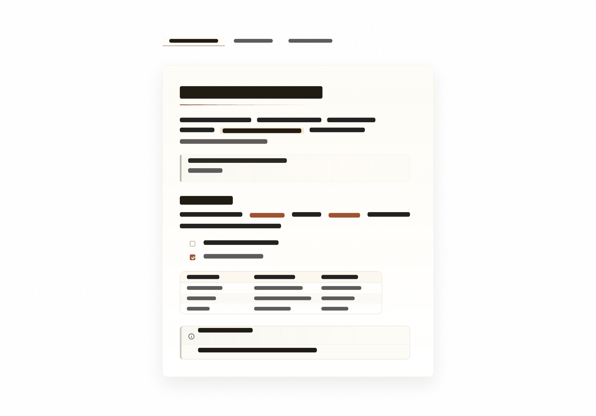

# Scriptorium

_長い思考のための、静かな机。_

[English](./README.md) | [Chinese](./README.zh-CN.md)

  
  
  

長文の読書と執筆のための、温かくミニマルな Obsidian テーマです。

Scriptorium は本文を主役に保ちます。やわらかな紙の色、抑えたコントラスト、静かなワークスペースのクローム、よりフラットなタグと callout、そして CJK とラテン文字の混在ノートに合わせたタイポグラフィを備えています。

> [!NOTE]
> Scriptorium は個人的な美意識を前提にしたテーマであり、`Style Settings` プラグインの対応を目的としていません。

## インストール

1. Obsidian の Community Themes で `Scriptorium` を検索します。
2. **Install and use** をクリックします。

手動インストール: `theme.css` と `manifest.json` を `.obsidian/themes/Scriptorium/` にコピーし、Appearance -> Themes で `Scriptorium` を選択します。

## 設計

- Scriptorium は IBM Plex ファミリーで組まれています。[IBM Plex Sans JP](https://fonts.google.com/specimen/IBM+Plex+Sans+JP)、[IBM Plex Serif](https://fonts.google.com/specimen/IBM+Plex+Serif)、[IBM Plex Mono](https://fonts.google.com/specimen/IBM+Plex+Mono) を導入すると自動で適用されます（Google Fonts が利用できない場合は [IBM Plex 公式リリース](https://github.com/IBM/plex/releases)）。
- 外観設定で別のフォントを選ぶとそのフォントが優先され、IBM Plex と CJK フォールバックが続きます。
- ドキュメント面は軽く保つ: 画像的な質感、影、アクセント色は意図的に抑えています。
- ナビゲーション、検索、メニュー、タグ、callout、embed は静かに保ち、本文を中央に置きます。
- テーマは単一の `theme.css` として配布され、外部依存はありません。

## デザイン原則

テーマ編集時に守る指針として、以下を維持します:

- 温かい紙のパレットは抑制的に保つ。
- 面は清潔に保ち、質感はページを支え、本文と競合しない。
- 重いクロームよりもタイポグラフィの階層を優先する。
- 自動非表示の挙動は限定的で予測可能に保つ。
- 本文サイズのテキストで意味を持つアクセント色は慎重に使う。
- callout、embed、フローティング UI は同じマテリアル言語に揃えるが、日常の操作 UI を積み重なったカードのようにしない。
- タグは静かに保ち、見出しやリンクと競合させない。
- 読み心地を装飾的な新しさより優先する。

## 開発

可読ソースは `src/theme.css` にあります。編集後に `npm run build` を実行すると、esbuild が配布用の `theme.css` を生成し、ストアのサイズチェックに向けた軽量さを保ちます。`npm run lint` でソースに stylelint を実行します。

個人的な調整は CSS スニペットで行います——[snippet-example.css](snippet-example.css) は、安全に上書きできるトークンを一つずつ注釈付きで案内するファイルです。パレットのランプと上書きの三層構造も説明しています。

Created by [@ouatis](https://github.com/ouatis/). Inspired by [Sanctum](https://github.com/jdanielmourao/obsidian-sanctum) and [Baseline](https://github.com/aaaaalexis/obsidian-baseline).
