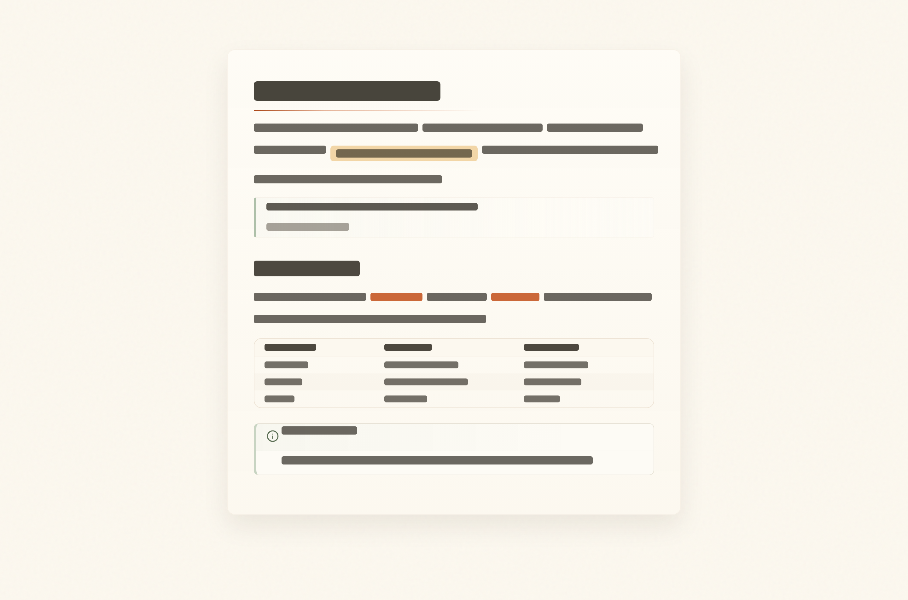

# Scriptorium 主题

一款温暖、简洁的 Obsidian 主题，面向长文阅读与写作。

[English](./README.md)

Scriptorium 让正文保持主位：柔和纸色、克制对比、安静的工作区界面、更平的标签与 callout，以及针对中英文混排调过的字体层级。

> [!NOTE]
> Scriptorium 是偏个人审美的主题，不以支持 `Style Settings` 插件为目标。

## 安装

1. 在 Obsidian 社区主题中搜索 `Scriptorium`。
2. 点击“安装并启用”。

手动安装：将 `theme.css` 和 `manifest.json` 放入 `.obsidian/themes/Scriptorium/`，再在“外观 -> 主题”中选择 `Scriptorium`。

## 设计

- 推荐字体：IBM Plex Sans SC、IBM Plex Serif、IBM Plex Mono。
- 阅读面保持轻：纹理、阴影和强调色都刻意压低。
- 导航、搜索、菜单、标签、callout 和 embed 尽量安静，让正文居中。
- 0.9.8 加入收拢状态栏胶囊、侧栏控件悬停显隐、更稳的移动端表格，以及减动偏好处理。
- 主题以单一 `theme.css` 发布，无外部依赖。

由 [@ouatis](https://github.com/ouatis/) 制作。受 [Sanctum](https://github.com/jdanielmourao/obsidian-sanctum) 与 [Baseline](https://github.com/aaaaalexis/obsidian-baseline) 启发。维护说明见 [SCRIPT-MAINTENANCE.md](./SCRIPT-MAINTENANCE.md)。
